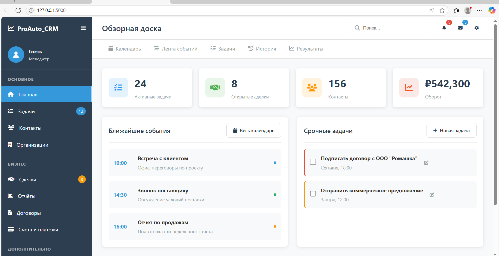
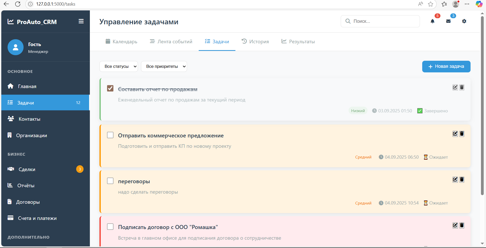

# 📅 ProAuto_CRM

**ProAuto_CRM** — это веб-приложение на Flask, позволяющее управлять задачами и календарными событиями. Проект реализован с использованием Flask, SQLAlchemy и поддерживает REST API для взаимодействия с задачами и событиями.
---

## 🎨 Скриншоты
Стартовая страница

---
## 🎨 Скриншоты
Управление задачами

---

## 🌟 Функционал

- **Управление задачами:**
  - Создание, редактирование и удаление задач
  - Фильтрация по статусу и приоритету
  - Поддержка приоритетов: `low`, `medium`, `high`, `urgent`
  - Статусы: `pending`, `in_progress`, `completed`, `cancelled`

- **Календарь событий:**
  - Просмотр событий по дням, неделям и месяцам
  - Поддержка разных типов событий: встреча, звонок, напоминание и др.
  - Управление временем начала и окончания

- **REST API:**
  - Полный набор API-эндпоинтов для задач и событий
  - Поддержка `GET`, `POST`, `PUT`, `DELETE` запросов

- **Демо-данные:**
  - Автоматическое создание тестовых задач и событий при первом запуске

---

## 🛠️ Технологии

- **Python 3.x**
- **Flask** — веб-фреймворк
- **Flask-SQLAlchemy** — ORM для работы с базой данных
- **Flask-Migrate** — миграции базы данных (через Alembic)
- **SQLite** (по умолчанию) или любая другая СУБД (PostgreSQL, MySQL)
- **Jinja2** — шаблонизация
- **datetime** — работа с датами и временем

---

